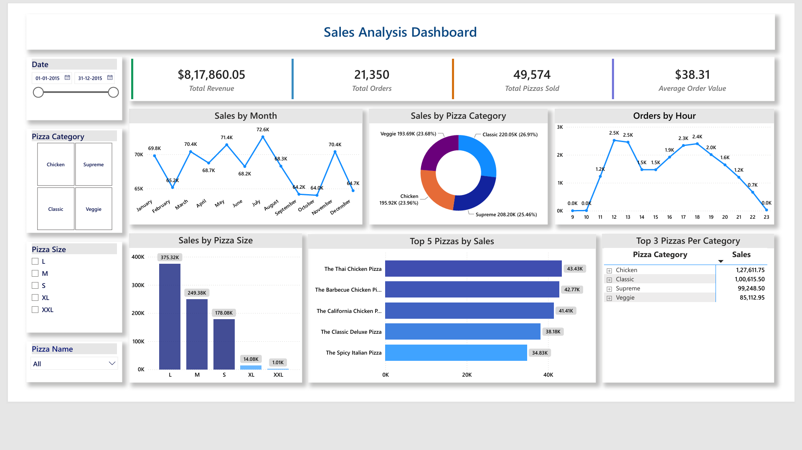

# 🍕 Pizza Sales Analysis

## Project Overview
This project analyzes pizza sales data using MySQL to uncover insights about revenue, order trends, and pizza performance. The analysis covers basic aggregations, intermediate joins, and advanced window functions.

---

## Tools Used
- **MySQL Workbench** — database creation, schema design, and data analysis
- **Power BI Desktop (Version 2.155.756.0 June 2026)** — building interactive dashboard

---

## Dashboard

### Data Connection
- Connected Power BI directly to MySQL database and selected required tables
- Imported Q13 query result (Top 3 Per Category) separately as CSV

### KPI Cards
| Card | Value |
|------|-------|
| Total Revenue | $8,17,860.05 |
| Total Orders | 21,350 |
| Total Pizzas Sold | 49,574 |
| Average Order Value | $38.31 |

### Visuals
| Visual | Type | Description |
|--------|------|-------------|
| Sales by Month | Line chart | Monthly revenue trend |
| Sales by Pizza Category | Donut chart | Revenue % per category |
| Orders by Hour | Line chart | Order distribution by hour |
| Sales by Pizza Size | Bar chart | Revenue per pizza size |
| Top 5 Pizzas by Sales | Bar chart | Top 5 revenue pizzas |
| Top 3 Pizzas Per Category | Matrix | Top 3 pizzas grouped by category |

### Slicers
- Date slicer (range slider)
- Pizza Category (tiles)
- Pizza Size (checkbox)
- Pizza Name (dropdown)

### DAX Measures
- **Total Revenue** — sum of all pizza sales
- **Total Orders** — count of all orders
- **Total Pizzas Sold** — sum of all order quantities
- **Average Order Value** — total revenue divided by total orders

### Calculated Columns
- **Sales** — pizza price multiplied by order quantity
- **Order Hour** — hour extracted from order time

### Calendar Table
- Created calendar table for date slicer and time intelligence

---

## Dataset
The dataset consists of 4 tables with pizza sales data:

| Table | Description |
|-------|-------------|
| `orders` | Order ID, date, and time of each order |
| `order_details` | Order details ID, order ID, pizza ID and quantity |
| `pizzas` | Pizza ID, type, size, and price |
| `pizza_types` | Pizza name, category, and ingredients |

---

## Database Schema

```
pizza_types          orders
    |                  |
    |                  |
  pizzas      →   order_details
```

### Relationships
- `pizza_types` → `pizzas` (one to many)
- `orders` → `order_details` (one to many)
- `pizzas` → `order_details` (one to many)

---

## Project Structure

```
pizza_sales/
│
├── data/                                    # raw csv files
│   ├── orders.csv
│   ├── pizza_types.csv
│   ├── pizzas.csv
│   ├── order_details.csv
│   └── top_3_per_category.csv               # Q13 query result exported for Power BI
│
├── scripts/                                 # sql files
│   ├── 01_setup.sql    # database and table creation
│   └── 02_analysis_queries.sql              # all analysis queries
│
├── dashboard/                               # power bi dashboard
│   ├── pizza_sales_dashboard.pbix           # editable Power BI file
│   ├── pizza_sales_dashboard.pdf            # exported PDF
│   └── pizza_sales_dashboard.png            # dashboard screenshot
│
├── screenshots/                             # query and result screenshots
│
├── er_diagram.png                           # database schema diagram
├── pizza_sales_model.mwb                    # editable MySQL Workbench model
├── README.md                                # project overview
└── documentation.md                         # detailed documentation
```

## Dashboard Screenshot



---

## How to Run

1. Open **MySQL Workbench**
2. Run `scripts/1_create_tables.sql` to create the database and tables
3. Import CSV files from `data/` folder into respective tables in this order:
   - `orders`
   - `pizza_types`
   - `pizzas`
   - `order_details`
4. Run `scripts/2_analysis_queries.sql` for all analysis queries
5. Open `dashboard/pizza_sales_dashboard.pbix` in Power BI to view dashboard

---

## Analysis Summary

### Basic
- Total number of orders placed
- Total revenue generated
- Highest priced pizza
- Most common pizza size ordered
- Top 5 most ordered pizza types

### Intermediate
- Total quantity ordered per pizza category
- Order distribution by hour of day
- Category wise pizza distribution
- Average pizzas ordered per day
- Top 3 pizza types by revenue

### Advanced
- Percentage contribution of each category to total revenue
- Cumulative revenue generated over time
- Top 3 revenue generating pizzas per category

---

## Key Insights
- A total of **21,350 orders** were placed generating revenue of **$817,860.05**
- **Large size** pizzas were the most ordered with **18,956** pizzas sold
- **12PM** is the peak hour for orders with **2,520** orders placed
- **Classic category** is the most ordered with **14,888** pizzas and contributes the highest revenue at **26.91%**
- **The Classic Deluxe Pizza** is the most ordered pizza with **2,453** orders
- **Thai Chicken Pizza** generates the highest revenue at **$43,434.25**
- **Veggie category** contributes the lowest revenue at **23.68%**
- Average of **138 pizzas** are ordered per day
